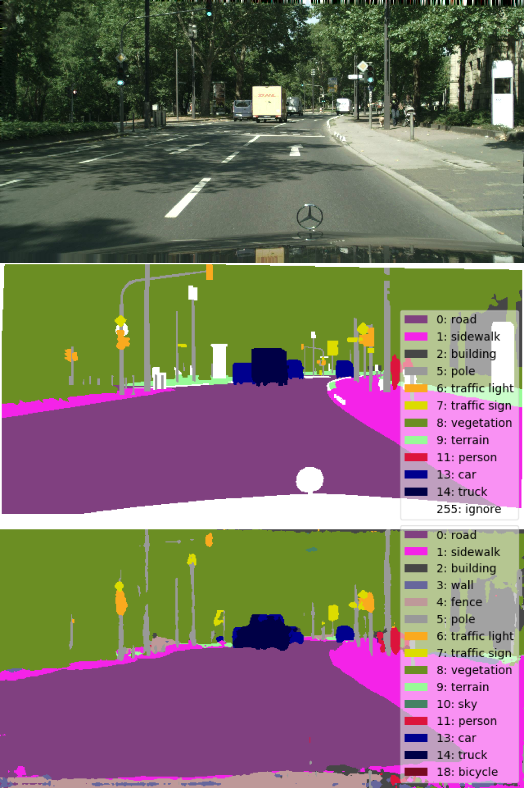
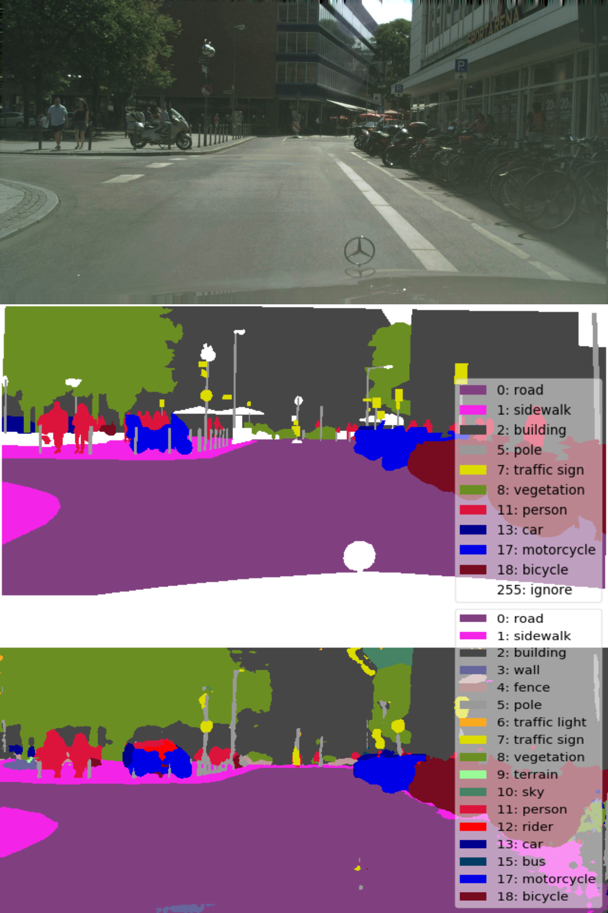

# MobileNetv3

A tensorflow implementation of MobileNetv3 for image classification and semantic segmentation.
According to the paper: [Searching for MobileNetv3](https://arxiv.org/abs/1905.02244?context=cs)

# Semantic Segmentation Results

| Network | mIOU |
|--------|--------|
| large1.0|59.25  |

There are some examples of trained model.

